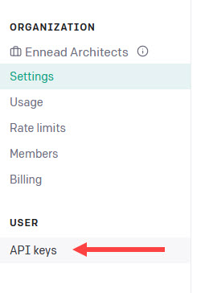
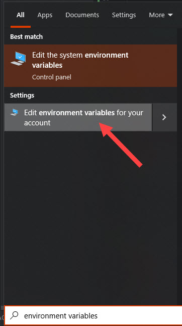
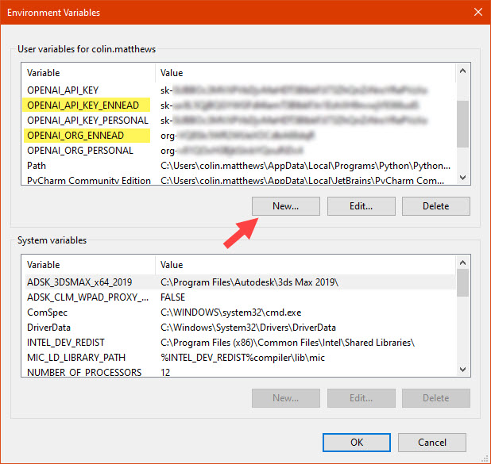

# EA-GPT

### An internal chatbot for Ennead Architects.

EA-GPT is a custom chatbot tool developed by 
Applied Computing for use on office projects that deal
in sensitive data or require a chatbot with a factual
knowledge of Ennead Architects' brand identity and prior projects.

The chatbot is powered by the GPT-series of Large Language Models (LLMs),
developed by OpenAI. Future development will increase this selection 
of models to include open-source options as well as the Claude series
of LLMs developed by Anthropic.

### This README file is for setting up the chatbot to run locally in a terminal interface.

### Future development will bring this chatbot to a browser interface.

Please follow the steps below in order to start using this tool on your machine:

## Set up an account with OpenAI to receive an API key
   You must have an **OpenAI API Key** in order to use this tool. Please contact Applied Computing 
   if you require an invitation to the Ennead OpenAI account. You can also use a personal key 
   if you have your own OpenAI account.
   
   Please note that this is not the same thing as having a ChatGPT account!
   
   You can access your OpenAI API keys [**here**](https://platform.openai.com/account).
   
   
   
   Click the button "Create new secret key," give it a name, and then copy the key someplace safe 
   (like on your P: drive). You should also save the **Organization ID**, which can be found under 
   "Settings" in your account menu.

## Set your environment variables
1. #### In the Windows start menu, type `environment variables` and select "Edit environment variables for your account".

   \

2. #### Create the following environment variables for your user account:
   
   
   
## Installation
In order to use this chatbot, follow the installation instructions below:
1. #### Download Python [3.10.6](https://www.python.org/ftp/python/3.10.6/python-3.10.6-amd64.exe)

2. #### Run the Python installer

Once the installation is complete, you can verify whether 
Python was installed correctly by opening a commmand prompt (type `cmd` in the
start menu) and running `python --version`.

3. #### Download [Git](https://github.com/git-for-windows/git/releases/download/v2.41.0.windows.3/Git-2.41.0.3-64-bit.exe)

4. #### Run the Git installer
You can select all the default options during the installation process. 
There will be many windows; just keep clicking through until the installation starts.

5. #### Create a folder where you want to store the EA-GPT installation.
This is typically in the Users folder (_i.e._ "C:\Users\colin.matthews\Github")

6. #### Right click anywhere in your folder window and select "Open Git Bash here."

7. #### Clone this repository to your computer.
Copy and paste the following command into Bash and press enter: `git clone https://github.com/Ennead-Architects-LLP/EAGPT.git`

8. #### Read about navigating through a folder structure in the terminal.
_Navigating through a folder structure using a terminal interface is easy. Just follow these instructions._
- `cd` stands for "**c**hange **d**irectory". You can `cd` into any folder like this: `cd path\to\your\folder`
- In this case, since you already activated Git Bash in the location where you copied EA-GPT, you can move into that folder by running the command `cd EAGPT`
- In a **Bash** terminal, you can always check the current folder (also known as a directory) by using the `pwd` command, which stands for "**p**resent **w**orking **d**irectory". In the **Windows Command Prompt** or **Windows Power Shell**, you would use the `cd` command to check the current directory. 
- You can list all the files in your current directory by using the `ls` command. In **Windows Command Prompt** or **Windows Power Shell** you would use `dir`.
- To move backwards in a file hierarchy (_i.e._ to move up one folder) use `cd ..`

9. #### Navigate into the EA-GPT folder.
`cd EAGPT`

10. #### Create a virtual Python environment to run EA-GPT in.
`python -m venv venv` 
This will create a folder "venv" in "EAGPT" that contains a copy of Python 
and, eventually, all the required modules for running the chatbot.

11. #### Activate the virtual environment.
`source venv/Scripts/activate`

12. #### Install the modules.
`pip install -r requirements.txt` This command instructs the package manager to install all the 
necessary Python libraries listed in the _"requirements.txt"_ file.

13. #### Run EA-GPT.
`python EAGPT_terminal.py`

## Operating Instructions
1. When you first initialize the chatbot, it will ask you for authentication. If you set up your 
environment variables as instructed above, you should be able to just select "Y" when prompted
whether you wish to use environment variables and then select "Y" to use Ennead's API account.

2. Next, the chatbot will ask you several questions to help initialize the model. 
   - **Model** - which of OpenAI's various chat models you wish to use.
   - **Temperature** - Lower values for temperature result in more consistent outputs, while higher values 
   generate more diverse and creative results. Select a temperature value based on the desired trade-off 
   between coherence and creativity for your specific application.
   - **Profile** - EA-GPT comes pre-loaded with a few system profiles, which basically give the chatbot 
   some context and factual knowledge before beginning the conversation. You can add your own profiles by
   dropping .txt files in the  "profiles" folder located in the project directory. You can also include a 
   description .txt file to give the chatbot a descriptive label for your new profile.

3. Begin your conversation! 

4. Please give feedback to Colin Matthews or suggestions for additional features. Please note that this project
is in alpha testing and will change dramatically in the coming months. To sync further developments of 
this project, simply `cd` into the "EAGPT" directory and run the following command in Bash: `git pull`.